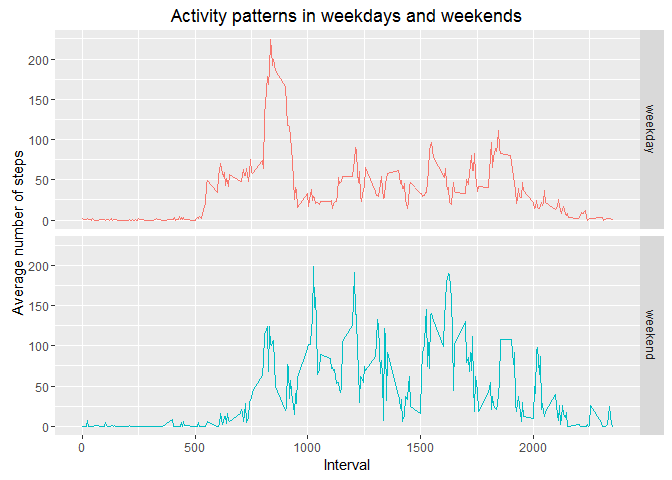

# Reproducible Research: Peer Assessment 1


## Loading and preprocessing the data
Loading the data requires unzip the file "activity.zip" that comes in the respository. After that, the data is loaded in a dataframe called "actData".


```r
#Unzip the data file
unzip("activity.zip", unzip="internal")
#Load data in data.frame
actData<-read.csv("activity.csv")
```

## What is mean total number of steps taken per day?
In order to make the histogram of the total number of steps taken each day,  actData must be grouped by the date. Afterwards, this result is summarized to sum up the total number of steps taken each day.
Finally, the histogram is made and the mean and median are calculated.


```r
library(dplyr)
by_date<-group_by(actData,date)
steps_perdate<-summarize(by_date, steps=sum(steps, na.rm = TRUE))
hist(steps_perdate$steps, 
     main="Total steps taken by day",
     xlab="Number of steps taken by day",
     col="red", 
     breaks=20)
```

 

```r
meanSt<-mean(steps_perdate$steps)
medianSt<-median(steps_perdate$steps)
```
In conclusion, the mean total number of steps taken per day is 9354.2295082 and the median is 10395.


## What is the average daily activity pattern?

In order to find the average daily activity pattern, the data frame actData must be grouped by interval. Afterwards, this results is summarized to average the number of steps taken in that interval of time across all the days of the dataset.


```r
library(dplyr)
by_interval <- group_by(actData, interval)
steps_perinterval<- summarize(by_interval, avg=mean(steps, na.rm=TRUE))
plot(x=steps_perinterval$interval, 
     y = steps_perinterval$avg, 
     type="l",
     main="Average daily activity pattern",
     xlab="5 minutes intervals",
     ylab="Number of steps averaged on all dates")
```

 

```r
maxInterval<-steps_perinterval[which.max(steps_perinterval$avg),]$interval
```
Finally, the interval with a max number of average steps is: 835.

## Imputing missing values
The next code calculates the number of missing values present in the dataset given.

```r
totalNA<- sum(is.na(actData$steps))
```
In total there are 2304 values.

### Strategy for filling the missing values
The proposed strategy is to fill this missing values with the average of that interval in time in that day of the week. The justification for this strategy is that the intervals in time might be really different for different days of the week, however on the same day of the weeks across all dates, the average can be similar.
The next code show how to get the average number of steps by interval in each day of the week:

```r
##Group data by interval
by_interval_day<- group_by(actData, 
                           interval,
                           day=weekdays(as.Date(actData$date)))
##Average steps in each time interval and day of the week
avg_steps<-summarize(by_interval_day, avg=mean(steps, na.rm=TRUE))
##The first data in dataset is a monday
mondAvg<-avg_steps[avg_steps$interval==actData[1,]$interval & avg_steps$day==weekdays(as.Date(actData[1,]$date)), ]$avg
```
For example, on mondays in the 0 minute interval the average is 1.4285714.

The next code will change every missing value according to the strategy presented.


```r
##Get the indices of each na value in steps
na.steps<- which(is.na(actData$steps))
## Get the dates and intervals of each na
na.dates<- actData$date[na.steps]
na.intervals<- actData$interval[na.steps]
##Get the vale to fill for each na value
na.avg_steps<-sapply(na.steps, function(x){
    x<-avg_steps[avg_steps$interval==actData[x,]$interval & avg_steps$day==weekdays(as.Date(actData[x,]$date)), ]$avg
    }
    )
##Create a new data frame and replace the values
nActData<-actData
nActData$steps[na.steps]<-na.avg_steps 
```
The histogram obtained with this new dataset is made with the next code and presented below.


```r
library(dplyr)
by_date<-group_by(nActData,date)
steps_perdate<-summarize(by_date, steps=sum(steps, na.rm = TRUE))
hist(steps_perdate$steps, 
     main="Total steps taken by day",
     xlab="Number of steps taken by day",
     col="red", 
     breaks=20)
```

 

```r
meanSt2<-mean(steps_perdate$steps)
medianSt2<-median(steps_perdate$steps)
```
The mean total number of steps taken per day is 9354.2295082 and the median is 10395. These values are quite different from the ones presented previously, however the difference is not that big and the histogram keeps the same shape it used to have. Nonetheless it's important to study if the strategy applied to replace missing values really works.


```r
diffMean<- meanSt2-meanSt
diffMedian<- medianSt2-medianSt
perMean<- diffMean*100/meanSt
perMedian<-diffMedian*100/medianSt
```

Specifically, there is an increase of 15.6825326% in the mean and an increse of 5.964406% in the median.


## Are there differences in activity patterns between weekdays and weekends?

The next piece of code makes the plot of the different activity patterns in weekdays and weekends.


```r
library(lubridate)
#In lubridate the day 1 is sunday, so:
## Apply the factor "weekend" to those dates whose days are 1 or 7
 nActData$wday[wday(nActData$date)==(1| 7)]<-"weekend"
## Apply the factor "weekday" to any date whose days are not 1 or 7
 nActData$wday[wday(nActData$date)!=(1| 7)]<-"weekday"
 
 #Group data by interval and wday (weekend/weekday)
 nby_interval <- group_by(nActData, interval, wday)
 #Summarize to get the mean of the steps across each interval in the differents wday (weekend/weekday)
 nsteps_perinterval<- summarize(nby_interval, avg=mean(steps))
 nsteps_perinterval$wday<-as.factor(nsteps_perinterval$wday)
 
 ##Plot!
library(ggplot2)
ggplot(data=nsteps_perinterval, aes(x=interval, y=avg, colour=wday)) +  geom_line() +facet_grid(wday~.)+ ggtitle("Activity patterns in weekdays and weekends") + xlab("Interval") + ylab("Average number of steps") + theme(legend.position="none")
```

 

As can be seen in the plot, yes, there are some differences in the patterns, especially in the interval 500-1750 aprox. However, the patterns are very similar in the beginnings and endings of the intervals (intervals 0-500 and 2000-2355).
